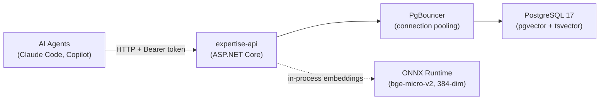

# agent-expertise-api

[](https://github.com/TheSemicolon/agent-expertise-api/actions/workflows/ci.yml)
[](https://github.com/TheSemicolon/agent-expertise-api/actions/workflows/release.yml)

Self-hosted .NET 10 REST API for storing and serving expertise entries consumed by AI agents. Entries are a running log of issues/fixes, workarounds, caveats, and requirements — either domain-specific or shared across agent domains.

## Architecture



## Tech Stack

| Component | Technology |
|-----------|-----------|
| Runtime | .NET 10 (LTS) |
| Framework | ASP.NET Core Minimal APIs |
| Database | PostgreSQL 17 + pgvector + tsvector |
| Connection pooling | PgBouncer 1.21+ (transaction mode) |
| Embeddings | In-process ONNX (bge-micro-v2, 384-dim) |
| Data access | EF Core (repository pattern) |
| API docs | Scalar (OpenAPI) |
| Local dev | Docker Compose |
| CI/CD | GitHub Actions (build + push to GHCR) |

## API Surface

| Method | Endpoint | Purpose |
|--------|----------|---------|
| GET | `/expertise` | List/filter entries by domain, tags, type, severity |
| GET | `/expertise/{id}` | Get single entry |
| POST | `/expertise` | Create entry (generates embedding) |
| POST | `/expertise/batch` | Create up to 100 entries (generates embeddings, deduplicates) |
| PATCH | `/expertise/{id}` | Update entry (regenerates embedding if title/body changed) |
| DELETE | `/expertise/{id}` | Soft delete (sets DeprecatedAt) |
| GET | `/expertise/search?q=` | Keyword full-text search (tsvector) |
| GET | `/expertise/search/semantic?q=` | Semantic vector search (pgvector) |
| GET | `/health` | Liveness probe (no auth required) |
| GET | `/metrics` | Prometheus scrape endpoint (no auth required) |
| GET | `/query` | Interactive query page (read-only, no auth to load) |

All endpoints except `/health`, `/query`, and `/metrics` require `Authorization: Bearer <api-key>`. See [SKILL.md](.claude/skills/expertise-api-design/SKILL.md) for scopes and optional parameters.

## Quick Start

```bash
# 1. Start the database
cp deploy/local/.env.example deploy/local/.env
# Edit deploy/local/.env — set POSTGRES_PASSWORD and AUTH__APIKEY
docker compose -f deploy/local/docker-compose.yml up -d postgres pgbouncer

# 2. Apply migrations
dotnet ef database update --project src/ExpertiseApi

# 2b. Download ONNX model files (required for embeddings and semantic search)
./scripts/download-models.sh

# 3. Run the API
dotnet run --project src/ExpertiseApi

# 4. Verify
curl http://localhost:5000/health

# 5. Browse the query page (interactive UI for search and filtering)
# http://localhost:5000/query
```

See [CLAUDE.md](CLAUDE.md) for full build commands, curl examples, and development guide.

## Deployment

A Helm chart is included at `helm/expertise-api/` for deploying to Kubernetes (k3s or any k8s cluster). The chart includes PostgreSQL, PgBouncer, and an optional S3 backup CronJob.

```bash
# Example deploy
helm upgrade --install expertise-api ./helm/expertise-api \
  -f my-values.yaml \
  --namespace expertise-api \
  --create-namespace
```

Docker images are published to GHCR on every push to `main`:

```text
ghcr.io/thesemicolon/agent-expertise-api:latest
ghcr.io/thesemicolon/agent-expertise-api:<short-sha>
```

## Testing

The test suite uses xUnit, FluentAssertions, NSubstitute, and [Testcontainers](https://dotnet.testcontainers.org/) (PostgreSQL + pgvector). **Docker must be running** for integration tests.

```bash
# Run all tests
dotnet test ExpertiseApi.slnx

# Helm chart render tests
bash helm/expertise-api/tests/test-render.sh
```

New features and bug fixes should include tests. See [CLAUDE.md](CLAUDE.md) for test project structure and filtering commands.

## Documentation

| File | Purpose |
|------|---------|
| [CLAUDE.md](CLAUDE.md) | Full build/run commands, local dev guide |
| [.claude/skills/expertise-api-design/SKILL.md](.claude/skills/expertise-api-design/SKILL.md) | Authoritative design reference (data model, API, architecture) |
| [.github/copilot-instructions.md](.github/copilot-instructions.md) | Copilot agent instructions |

## License

This project is not yet licensed. All rights reserved until a license is added.
